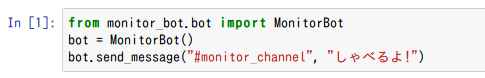
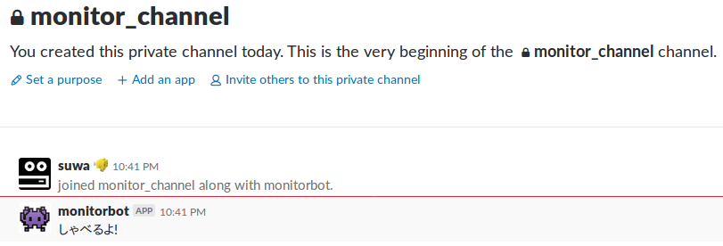
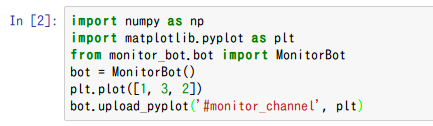
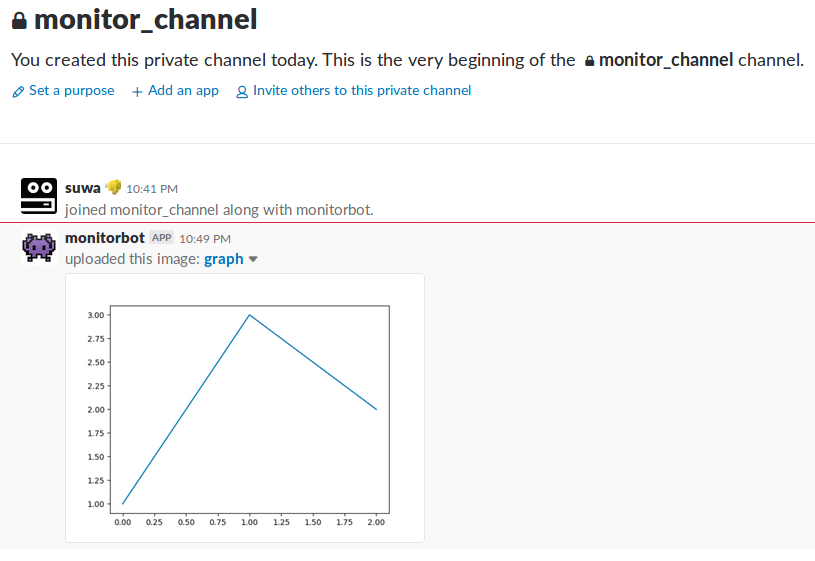
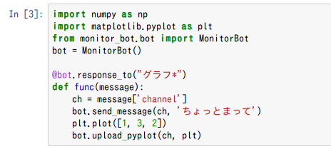
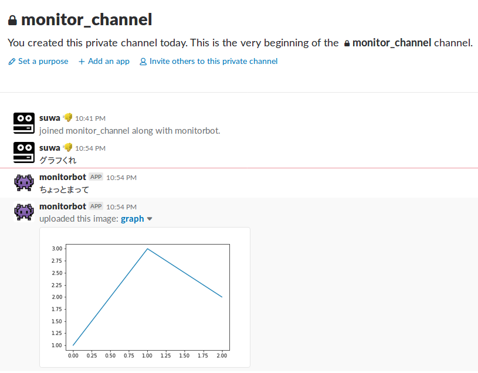

# Monitor Bot

## できること

### 1. Pythonスクリプト内に, あなたのSlackチャンネルへメッセージを送る機能を忍ばせられます.



### 2. メッセージ以外にも, Matplotlibで作成したグラフ画像や, PillowのImageも送ることができます.



### 3. Slackから実行中のPythonスクリプト内の関数をキックするように, BOTに命令できます.




## 使い方
最初にSlack Botのアカウントを作成する必要があります.  
以下のwebサイトを参考に, Botアカウントの作成とAPIトークンの取得を行ってください.

- Pythonを使ったSlackBotの作成方法(https://qiita.com/kunitaya/items/690028e33ba5c666f3e2)
- API トークンの生成と再生成(https://get.slack.help/hc/ja/articles/215770388-API-%E3%83%88%E3%83%BC%E3%82%AF%E3%83%B3%E3%81%AE%E7%94%9F%E6%88%90%E3%81%A8%E5%86%8D%E7%94%9F%E6%88%90)

APIトークンを取得できたら, 環境変数にAPIトークンを設定してください.  
環境変数名は `BOT_KEY` としてください.

Linux, MAC:  
`export BOT_KEY=set_your_api_tokenxxxxxxxxxxxxxxxxxxxxxxxxxx`

Windows:  
http://www.k-cube.co.jp/wakaba/server/environ.html

### モジュールのロード&インスタンス化
環境変数BOT_KEYが適切に設定されていれば, 以下のコードで
Botを使用する準備ができます.

##### コード例:
```python
from monitor_bot.bot import MonitorBot
bot = MonitorBot()
```

### 1. PythonスクリプトからSlackチャンネルにメッセージを送る.
メッセージを送るには以下の関数を使います.

```MonitorBot.send_message(channel, message, attachments=None)```

- channel(string): メッセージを送る先となるchannelです.
- message(string): メッセージ.
- attachments(json): メッセージの色を変えるなど, 付加情報をつけられます. データ構造などの詳しい情報はSlackClientのWebページを参考にしてください.

##### コード例:
```python
from monitor_bot.bot import MonitorBot
bot = MonitorBot()
bot.send_message(`@someone`, 'Hello')
```

### 2. PythonスクリプトからSlackチャンネルに画像を送る.
画像を送る関数は2種類あります.

以下の関数はMatplotlibで作成したグラフをSlackに送り, 表示します.  
```MonitorBot.upload_pyplot(channel, pyplot_obj)```

- channel(string): メッセージを送る先となるchannelです.
- pyplot_obj(matplot module): upload_pyplot関数内で`pyplot_obj.savefig()`を呼んでいるので, savefig関数を持つmatplotlibのオブジェクトを渡してください.

##### コード例:
```python
import matplotlib.pyplot as plt
from monitor_bot.bot import MonitorBot
bot = MonitorBot()
plt.plot([1, 3, 2])
bot.upload_pyplot("@someone", plt)
```


以下の関数はPillowモジュールのImageオブジェクトをSlackに送り, 表示します.  
```MonitorBot.upload_pillow(channel, pillow_img_obj)```
- channel(string): メッセージを送る先となるchannelです.
- pillow_img_obj(pillow image bject): Pillowモジューつが提供しているImageオブジェクト.


##### コード例:
```python
from PIL import Image
from monitor_bot.bot import MonitorBot
bot = MonitorBot()
img = Image.fromarray(np.random.randint(0, 255, size=(128, 128, 3)).astype(np.uint8))
bot.upload_pillow("@someone", img)
```

### 3. Slackから送られてきたメッセージに応答する.
SlackからBot宛に送られたメッセージに対する処理を定義するデコレータを使うことができます.

``` MonitorBot.response_to(pattern) ```

- pattern(string): どのようなメッセージに対して反応するかを定義する文字列. 正規表現が使用可能.

以下のコード例では, Botに対してHelloという文字を含むメッセージが送られた時に, 
関数`func`を呼び出すよう定義しています. 関数funcではsend_message関数を使って, Holaという
メッセージを送り返しています.

##### コード例:

```python
from monitor_bot.bot import MonitorBot
bot = MonitorBot()
@bot.response_to("Hello")
def func(message):
    # Checking from which channel the message came.
    ch = message['channel']
    bot.send_message(ch, "Hola")
```
